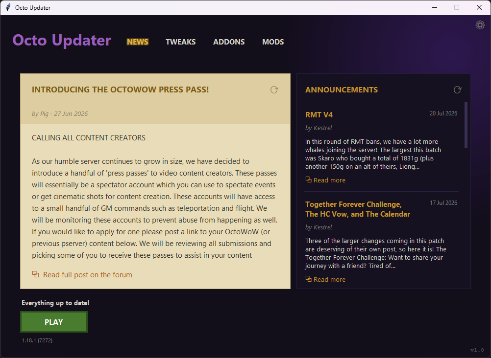

# Octo Updater

A standalone desktop updater and mod manager for the **OctoWoW** client.
It updates and patches the game client, manages community **mods** and **addons**,
applies client **tweaks**, and shows server **news**.



---

## Features

### 🔄 Client updates
- Verifies the local client against the server manifest (per-file SHA-1) and
  downloads only what changed.
- Resumable downloads (HTTP range), live speed/size readout, automatic retry
  with backoff, and integrity re-check after each file.
- Reads and displays the installed client version straight from `WoW.exe`.

### 🧩 Mods
Curated set of client modifications, installed from their official GitHub /
Codeberg releases and registered in `dlls.txt`:

| Mod | Purpose |
|-----|---------|
| VanillaFixes | Eliminates stutter and animation lag (also the DLL loader; required by other mods) |
| ClassicAPI | Adds later-version Lua API calls to the client; required by some addons |
| DXVK | Vulkan-based rendering for better performance |
| nampower | Reduces input lag on higher latency |
| SuperWoW | Backported client API features; required by some addons |
| transmogfix | Fixes transmog-related frame drops |
| UnitXP_SP3 | Adds modern quality-of-life features and improvements |
| VanillaHelpers | Raises the max supported texture resolution and improves memory allocation |
| VanillaMultiMonitorFix | Fixes multi-monitor resolution issues (optional) |

- Essential mods (★) auto-install on a fresh game folder.
- Per-mod **update** / **retry** actions and an update-count badge on the tab.

### 🎛️ Tweaks
Patches `WoW.exe` and writes `Config.wtf` for common quality-of-life settings:
Field of View, render distance, nameplate range, camera distance, ground
clutter distance, always-auto-loot, background sounds, and more. Invalid values
are clamped; Apply/Reset appear only when something changed.

### 📦 Addons
- Installs addons directly from Git hosts (**GitHub, GitLab, Gitea, Codeberg**)
  by downloading the repo archive pinned to a commit SHA — no Git client needed.
- Curated **recommended** list (★) plus everything from the server catalog.
- **Add custom git addon** dialog for any allowed host.
- Update detection by comparing the installed commit against the latest,
  one-click **Update** / **Update all**, and an update-count badge.
- pfUI gets a curated **"Default"** profile injected and added to its firstrun
  picker after each install/update.

### 📰 News
Pulls the live announcements feed and the featured forum post.

### ⚙️ Settings
Change the game folder, check mirror status, verify game files, view session
logs, add the game folder to Defender exclusions, and adjust general options.

### 🔒 Security & robustness
- Hardened TLS (system trust store, hostname check, TLS 1.2+ floor).
- HTTPS-only with per-host allowlists for all downloads; redirects stay HTTPS.
- Atomic config writes (temp + rename) with a lock — safe against concurrent
  workers and interrupted saves.
- Path-traversal-safe archive extraction.
- Automatic self-update check against this repo's GitHub releases (once a day).

---

## Requirements

- **Windows** (the client, Defender-exclusion and launch features are Windows-only).
- **Python 3.10+** — only if running from source. Runs on the standard
  library, and will also use [`certifi`](https://pypi.org/project/certifi/) if
  installed, for more robust TLS verification on machines with an out-of-date
  root store (otherwise falls back to the system trust store).
- The prebuilt `OctoUpdater.exe` needs nothing installed.

---

## Usage

### Prebuilt executable
Download `OctoUpdater.exe` from the [latest release](../../releases/latest) and
run it. Point the **Game folder** (Settings ⚙) at your OctoWoW client folder —
or let the default create one next to the executable — then click **UPDATE**,
and **PLAY** when it finishes.

### From source
```bash
python octo_updater.py
```

The updater writes two files next to itself:

| File | Purpose |
|------|---------|
| `octo_updater_config.json` | Settings, mod/addon install records, caches |
| `octo_updater_hash_cache.json` | Per-file SHA-1 cache to speed up verifies |

Both are safe to delete — they'll be recreated (deleting the config re-runs
first-time setup).

---

## Building

Compile a single-file Windows executable with
[PyInstaller](https://pyinstaller.org/):

```bash
pip install pyinstaller certifi
pyinstaller --onefile --windowed --name OctoUpdater --icon OctoUpdater.ico octo_updater.py
```

Installing `certifi` before building bundles an up-to-date CA certificate set
into the executable, so TLS verification works even on machines whose Windows
root store is stale.

---

## Support the Developer

If Octo Updater is useful to you, consider supporting its development:

- 💜 [Ko-fi](https://ko-fi.com/rebased)
- ☕ [Buy Me a Coffee](https://buymeacoffee.com/rebased)

---

## License

See [LICENSE](LICENSE).
